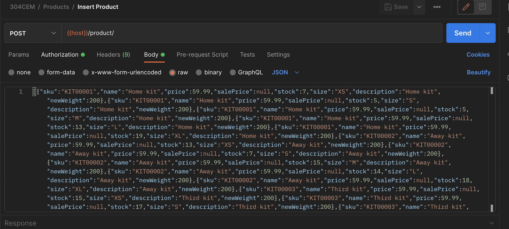

# 304CEM Assignment


 Hi, I'm Stephen and this is the repo of my 304CEM Assignment, which is created by using node.js and express.js.


## Installation

Make sure you have intstalled mongodb in your machine and power it on

```bash
    cd /path/to/the/304CEM-Backend
    npm i
    node app.js
```
I've made a [postman](https://www.postman.com) collection for this repo and you could download it [here](
https://github.com/CFTai/304CEM-Backend/blob/main/304CEM.postman_collection.json)

Before starting the service, 
you should generate a random product list and import those products into database.

Here are the steps:

First, direct to the root directory in your terminal and then run this command:

```bash
    node test.js
```

You will get a json array like this

```bash
[
    {
        "sku":972,
        "name":"Home kit",
        "price":59.99,
        "salePrice":null,
        "stock":0,
        "size":"XS",
        "description":"Home kit",
        "newWeight":200
    },
    ....
]
```

Copy the result json and then you could run the following command to run the backend service

```bash
node app.js

or

nodemon app.js
```

if it returns zsh: command not found: nodemon, please run 

```bash
source ~/.nvm/nvm.sh
```

you should see the word 304CEM-Backend is listening on port 8080
Then, open postman, select 304/Products/Insert Products
paste the copied json into body field, remember select type as raw


